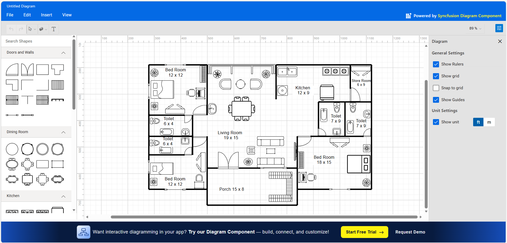

# Syncfusion® React Floor Planner Showcase

An interactive floor planner built using Syncfusion® Essential® Studio for React. Design room layouts with precision using walls, doors, windows, measurements, furniture, and annotations — all from the browser. Ideal for interior design, facility management dashboards, and real estate applications.

## Why use This React Floor Planner?
- Plan and iterate room layouts quickly with precise measurements.
- Communicate design intent clearly with symbols, labels, and dimensions.
- Boost productivity with snap, alignment, and editing utilities.

Optimized for modern web apps, this showcase leverages Syncfusion® React Diagram and supporting components to deliver a professional, high-performance planning experience. Keywords: React floor plan, room planner, furniture layout, architectural diagram, Syncfusion React Diagram.

## Key Features
- Wall/Room Design: Draw straight walls, create rooms, and measure distances between points.
- Symbols Library: Drag-and-drop furniture, doors, windows, and fixtures from a stencil/palette.
- Snapping & Guides: Grid, snap-to-objects, alignment guides, and smart handles for accurate placement.
- Selection & Editing: Move, resize, rotate, clone, lock, group/ungroup, and z-order operations.
- Rulers & Grid: Rulers with customizable units; configurable grid size and visibility.
- Measurements & Labels: Dimension lines, annotations, and editable text for labeling spaces.
- Zooming & Panning: Smooth zoom, pan, fit-to-screen, and keyboard shortcuts.
- Undo/Redo & History: Full interaction history for non-destructive editing.
- Persistence: Save/Load plans as JSON; import/export for sharing.
- Export: Export canvas as PNG, SVG, or PDF.
- Accessibility: Keyboard navigation and WCAG-friendly patterns.
- Performance: Optimized rendering for large plans and many symbols.

## Getting Started

### Prerequisites
- Node.js >= 18.0.0 (npm is installed with Node)

### Install & Run
To get the app up and running:

1.  **Clone the code:**  
    ```bash
    git clone https://gitea.syncfusion.com/essential-studio/ej2-react-floor-planner.git
    cd ej2-react-floor-planner
    ```

2.  **Install tools:**  
    ```bash
    npm install
    ```

3.  **Run in development mode:**  
    ```bash
    npm start
    ```
---

## Usage (Basic Example)
Below is a minimal React setup to render a basic floor planner.

For a quick start on setting up a React project with Syncfusion® Diagram, refer to our [Getting Started guide](https://ej2.syncfusion.com/react/documentation/diagram/getting-started).

1. **App Component (`App.js` or `App.jsx`)**

Import and configure Syncfusion® Diagram for React:
```jsx
import React from 'react';
import {
  DiagramComponent, Inject,
  UndoRedo, Snapping,
} from '@syncfusion/ej2-react-diagrams';

// Nodes Collection
const nodes = [
  {
    id: 'sofa',
    offsetX: 260,
    offsetY: 180,
    width: 140,
    height: 60,
    shape: {
      type: 'Path',
      data:
        'M 5 5 H 135 A 5 5 0 0 1 140 10 V 50 A 5 5 0 0 1 135 55 H 5 A 5 5 0 0 1 0 50 V 10 A 5 5 0 0 1 5 5 Z M 0 25 H 140',
    },
  },
  {
    id: 'table',
    offsetX: 440,
    offsetY: 180,
    width: 70,
    height: 70,
    shape: {
      type: 'Path',
      data: 'M 35 0 A 35 35 0 1 1 34.99 0 Z',
    },
  },
  {
    id: 'door',
    offsetX: 320,
    offsetY: 280,
    width: 80,
    height: 80,
    shape: {
      type: 'Path',
      data: 'M 0 0 L 0 80 L 80 80 M 0 0 A 80 80 0 0 1 80 80',
    },
  },
];

const snapSettings = {
  horizontalGridlines: {
    lineColor: '#eaeaea',
    snapIntervals: [10],
  },
  verticalGridlines: {
    lineColor: '#eaeaea',
    snapIntervals: [10],
  },
};

const rulerSettings = {
  showRulers: true,
  horizontalRuler: {
    interval: 50,
    segmentWidth: 50,
  },
  verticalRuler: {
    interval: 50,
    segmentWidth: 50,
  },
};

export default function App() {
  return (
    <div style={{ height: '100vh' }}>
      <DiagramComponent
        id="container"
        width={'100%'}
        height={'650px'}
        nodes={nodes}
        snapSettings={snapSettings}
        rulerSettings={rulerSettings}
      >
        <Inject services={[UndoRedo, Snapping]} />
      </DiagramComponent>
    </div>
  );
}
```

### Customizing for Your Use Case
This showcase is designed to be flexible for teaching, experimentation, and tooling.

#### Customizing Features
- Dimensions: Add connector-based dimension lines and auto-calculate lengths between wall endpoints.
- Editing: Provide context menus and property panels to adjust size, rotation, and materials.

#### Customizing palette
- Symbols: Build a palette of reusable floor-plan symbols (doors, windows, beds, appliances) and drag them onto the canvas.

#### Theming and Styling
- Switch themes by changing the CSS reference (material, bootstrap5, fluent, etc.)
- Fine‑tune colors and typography with the Syncfusion® EJ2 Theme Studio; include the generated CSS via src/index.html
- Override node, connector, and text styles via defaults or data‑driven properties

#### Interactions and Events
- Handle node/connector events for simulation toggles, selections, and property edits.
- Implement keyboard shortcuts for delete, duplicate, align, and distribute.

#### Persistence and Integration
- Serialize the diagram to JSON for save/load and sharing.
- Integrate with other Syncfusion® React components like DataGrid for parts lists or Toast for notifications.

#### Best Practices
- Keep a consistent unit system (e.g., pixels-as-cm scale) for predictable dimensions.
- Use Undo/Redo for all editing operations.
- Debounce autosave to avoid frequent writes while users drag/resize.

## Demo
- Web : https://ej2.syncfusion.com/showcase/react/floorplanner/index.html
-  


## Contributing
We welcome contributions! Fork the repo, make your changes, and submit a pull request. Please follow contribution best practices.

## License
Syncfusion® libraries require a valid license key in production. License guidance:
https://ej2.syncfusion.com/react/documentation/licensing/overview

## Support

- Open issues in this repository’s Issues section: https://gitea.syncfusion.com/essential-studio/ej2-react-floor-planner/issues.
- Explore more Syncfusion® React components: https://www.syncfusion.com/react-components.
- Community forums: https://www.syncfusion.com/forums.

Start building interactive diagrams today with [Syncfusion® EJ2 React Diagram!](https://www.syncfusion.com/react-components/react-diagram).